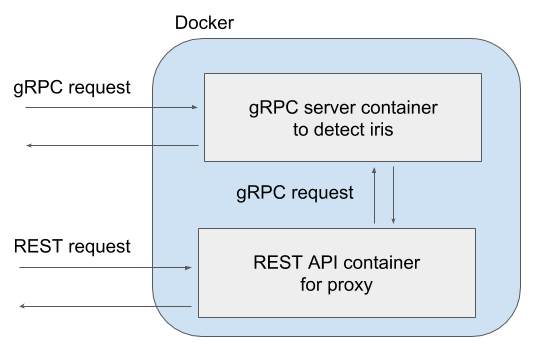

# Machine learning as a microservice in python

This is an example to service machine larning as a microservice in python.
The model predicts iris species by given sepal length, sepal width, petal length and petal width.

## Requirements

- Docker
- Anaconda
- Make

## Implement the files

1. Train a model for iris data with `./model/train.py`.
  - As a result, it saves a model to predict iris species in `iris_model.pickle`.
2. Define the protocol-buffer in `iris.proto`.
3. Implement a command to generate python files from `iris.proto` in `codegen.py`.
  - `iris_pb2.py` and `iris_pb2_grpc.py` are generated.
4. Implement `grpc_server.py`.
  - We predict iris species by given features in `grpc_server.py`.
5. Implement `iris_client.py`.
  - The files is just a client to request judging iris species with features which are fixed values of sepal length, sepal width, petal length and petal width.


## How to set up an environment on our local machine
The command creates an anaconda environment.
We can activate the environment with `source activate iris-predictor`, since the environment name is `iris-predictor`.
```
# Create an anaconda environment.
conda env create -f environment.yml -n iris-predictor

# Verify that the new environment was installed correctly, active environment is shown with '*'.
conda env list

# Remove the anaconda environment.
conda env remove -y -n iris-predictor
```

## How to run the server and the client on our local machine
Before running the predictor as a docker container, we can run the server and client on our local machine.
```
# Run serve.
python grpc_server.py

# Run client.
python iris_client.py
```

## How to build and run a docker image
We put the python files and saved model in the docker image.
Besides, the docker image is used for running `grpc_server.py`.

The host name depends on your environment.
If you use `docker-machine`, we can see the IP address with `docker-machine ip YOUR_DOCKER_MACHINE`.

The docker image exposes `50052` port for the gRPC server.
As well as, the gRPC server uses `50052`.
That's why we put `-p 50052:50052` in the `docker run` command.
```
# Build a docker image.
docker build . -t iris-predictor

# Run a docker container.
docker run --rm -d -p 50052:50052 --name iris-predictor iris-predictor

# Kill the docker container
docker kill iris-predictor
```

And then, we check if the client can access the server on docker or not:

```
# Execute it on your local machine, not a docker container.
python iris_client.py --host HOST_NAME --port 50052
Predicted species number: 0
```

## Appendix: HTTP/REST API
Sometimes you are faced with a situation that you need to offer both gRPC API and RESTful API.
To avoid duplicated work, we can also define the HTTP/REST API as just proxy to the gRPC API.
I know having requests internally can be in vein.
But, in terms of software development, a benefit that we don't need to develop different prediction functions is true as well.

The REST API as proxy is `rest_proxy.py`
It is simply implemented with [Flask\-RESTful](https://flask-restful.readthedocs.io/en/latest/).

And the definition to launch both the gRPC API and the RESTful API is in `docker-compose.yml`.



```
# Launch the gRPC server and REST server on docker
docker-composer -d

# Request to the REST API.
DOCKER_HOST="..."
curl http://${DOCKER_HOST}:5000/ -X POST \
  -d "sepal_length=6.8" \
  -d "sepal_width=3.2" \
  -d "petal_length=5.9" \
  -d "petal_width=2.3"

{"species": "2"}
```
